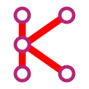

  
  <h1>Kneuron</h1>
  
<em>Enhancing the Knack Builder Experience</em>

## Overview

Kneuron is a Chrome/Edge browser extension designed to improve the user experience in the Knack Builder interface. It adds powerful features and quality-of-life improvements that make building and managing Knack applications more efficient.

## Key Features

- ⌨️ **Keyboard Shortcuts**: Navigate through the Builder quickly using intuitive keyboard shortcuts
- 🔍 **Smart Filtering**: Quickly find pages, tables, and other elements with instant search functionality
- 🎨 **UI Improvements**: Enhanced interface elements for better usability

## Browser Support

- Google Chrome
- Microsoft Edge
- Other Chromium-based browsers

## Installation & Documentation

For detailed installation instructions and comprehensive documentation, please visit our [Wiki](../../wiki).

The Wiki includes:
- Step-by-step installation guide
- Feature documentation
- Keyboard shortcut reference
- Tips and best practices
- Troubleshooting guide

## Getting Started

1. Visit our [Wiki](../../wiki) for installation instructions
2. Install the extension in your browser
3. Open the Knack Builder
4. Start enjoying the enhanced building experience!

## About

Kneuron is developed with the goal of making the Knack Builder more efficient and user-friendly. It's designed by Knack developers for Knack developers, focusing on the features that matter most in day-to-day development.

## Support

If you encounter any issues or have suggestions for improvements, please:
1. Check the [Wiki](../../wiki) for known solutions
2. Open an issue in the GitHub repository

---

  
Made with ❤️ for the Knack community

  
Normand Defayette - Cortex R&D Inc. - October 2024

